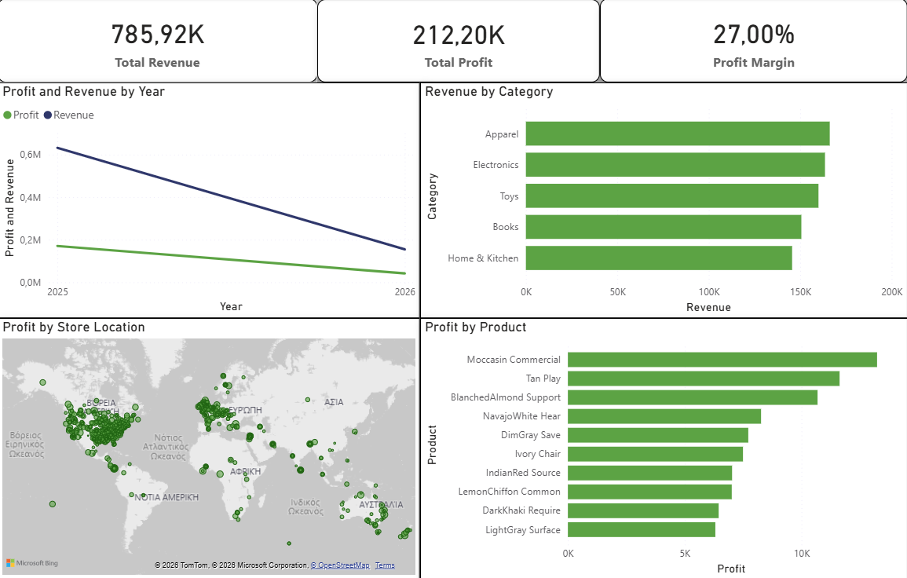

# 📊 End-to-End Retail Analytics Pipeline

A full-stack data engineering and BI project. This repository demonstrates a complete pipeline: from automated synthetic data generation in Python to SQL warehousing and executive-level reporting in Power BI.

## 📈 Dashboard Preview

## 🛠️ The Tech Stack
* **Data Generation:** Python (`Faker`) used to simulate a complex retail environment with 1,000+ transactions across global locations.
* **ETL Pipeline:** Pandas for data cleaning, handling nulls, and engineering **Net Profit** logic (Sales - COGS - OpEx).
* **Data Warehousing:** **MySQL** database implementing a clean Star Schema.
* **Reporting Layer:** SQL Views built for high-performance BI connectivity.
* **Visualization:** **Power BI** featuring interactive KPIs, Trend Analysis, and Geographic mapping.

## 📁 Repository Structure
* **`/data`**: Raw CSV files generated by the Python engine.
* **`/scripts`**: Python automation for data generation and the ETL pipeline.
* **`/sql`**: SQL scripts for creating reporting views and schema management.
* **`/reports`**: The final `.pbix` file and project screenshots.

## 💡 Key Business Insights
* **Profitability:** The business maintains a healthy **27% Net Profit Margin**.
* **Product Stars:** Identified "Moccasin Commercial" and "Tan Play" as top profit contributors.
* **Global Footprint:** Visualized high-density performance hubs in the US and Europe.

## 🚀 How to Run
1. Clone the repository.
2. Run `scripts/generate_synthetic_data.py` to create the dataset.
3. Use `scripts/etl_to_mysql.py` to load the data into your local MySQL instance.
4. Execute `sql/create_reporting_views.sql` to prepare the reporting layer.
5. Open `reports/retail_analytics_dashboard.pbix` to explore the dashboard.
